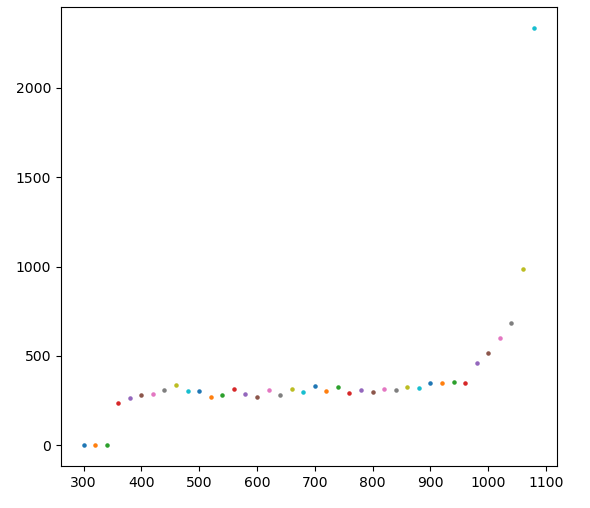

## Computer Interface

The device communicates over serial port, with a baud rate of 115200.

### using with minicom on linux

```bash
minicom -D /dev/ttyACM0
```

try the following commands. Press enter key after typing. 

`V?`
Returns the version string

`TIMELIMIT 30`
Sets time of acquisition to 30 seconds

`SETV 650`
Sets voltage to 650 Volts

`START`
starts acquisition

`TIME?`
fetches elapsed time

`COUNT?`
fetches count reading

`STOP`
Stops the counter if not already stopped by the timelimit. you can set timelimit to 0 to enable recording indefinitely.

## Using with a Python Program

???+ code "Plot the GM Tube Plateau"
	```python
	import serial, time
	from matplotlib import pyplot as plt


	#Connect to the serial port
	fd = serial.Serial('/dev/ttyACM0', 115200, stopbits=1, timeout = 1.0) 
	fd.read(10) # Clear junk data

	# write commands/queries to the instrument, and return the response.
	def command(q):
		fd.write((q+'\r').encode('utf-8'))
		return fd.readline().strip().decode()

	#Set the time limit
	duration = 30
	print(command('timelimit '+str(duration)))

	#Start with X Volts
	volts = 300
	while volts < 1100:
		command('setv '+str(volts)) 	# set the voltage
		plt.pause(0.1) 			#Wait 100 mS
		command('start')	    	# Start the counter
		plt.pause(duration+0.5)     	# Wait for data collection to complete
		counts = int(command('count?'))	# Query for total recorded counts
		plt.scatter(volts, counts ,s=5)

		volts+=20		   	# Increment voltage.

	plt.show()
	```

!!! tip "Results"
	Below is the voltage characteristics plot of the GM tube obtained using the above code.
	
	
	
	It can be seen that counts are nil below 350 volts. Then they are fairly constant till 900 volts , beyond which count rate increases rapidly due to continuous discharge. If high rates are observed, the device will show a warning, and it is advised to lower the voltage quickly to prevent damage to the tube.


## List of Commands

All commands/queries sent over the serial port must end with a \r . This is the return character, and is automatically
 added when you press `enter`(return) after typing the command into the serial terminal.


### :material-flash-outline: SETV
`SETV` followed by a voltage value from 0 to 1100 is used to set the voltage applied to the GM tube.
e.g. , to set 650 Volts

!!! tip "To set 650 Volts"
	SETV 650

### :material-flash-outline: VOLTS?

`VOLTS?` is a query used to read back the set the voltage of the GM tube.
it will return a number followed by \r\n


### :material-play: START

`START` starts the counter. After starting, the will wait for either the countdown timer to complete, or a STOP command, and then it will stop.

### :material-speedometer: COUNT?

`COUNT?` query reads the counts collected by the GM counter.

### :material-stop: STOP

`STOP` is used to force pause the GM Counter. You can use the `TIME?` and `COUNT?`queries to fetch elapsed time, and counts acquired.

### :material-clock-outline: TIME?

Read back elapsed time. returns a value in second units.

### :material-alarm: TIMELIMIT

`TIMELIMIT` followed by a number is used to set the time limit. Once the GM Counter is started, it will automatically stop after the limit is exceeded. To disable the TIMELIMIT, set it to 0, and the GM counter will count forever.

!!! tip "To set a 30 second limit"
	TIMELIMIT 30


