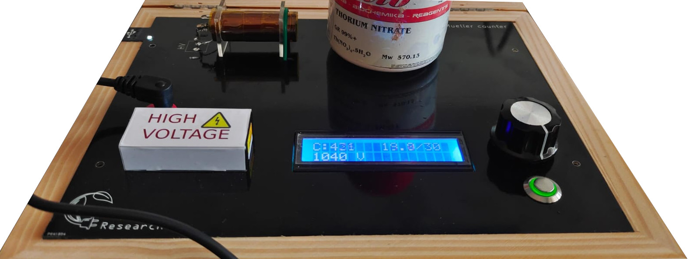
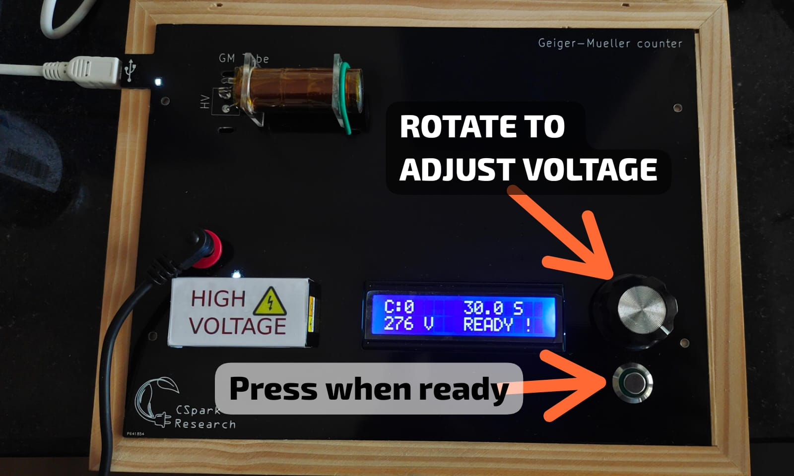
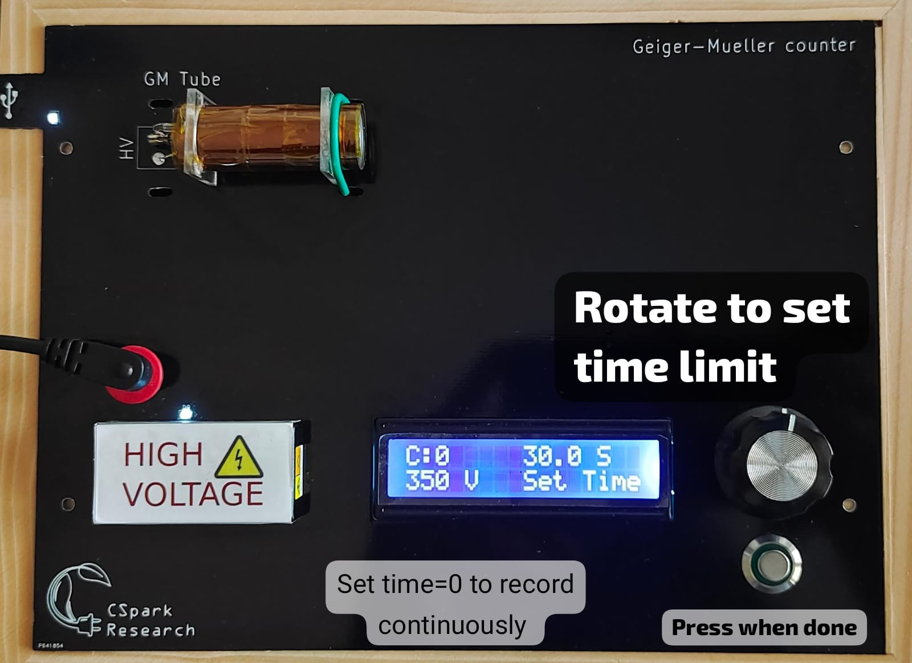
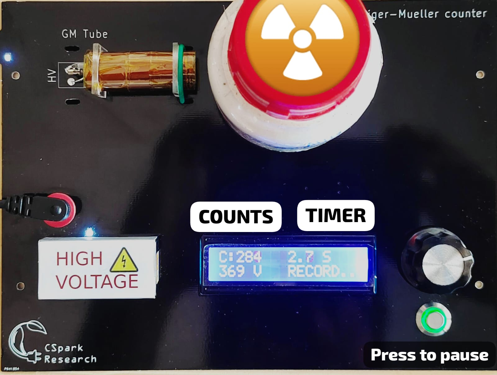
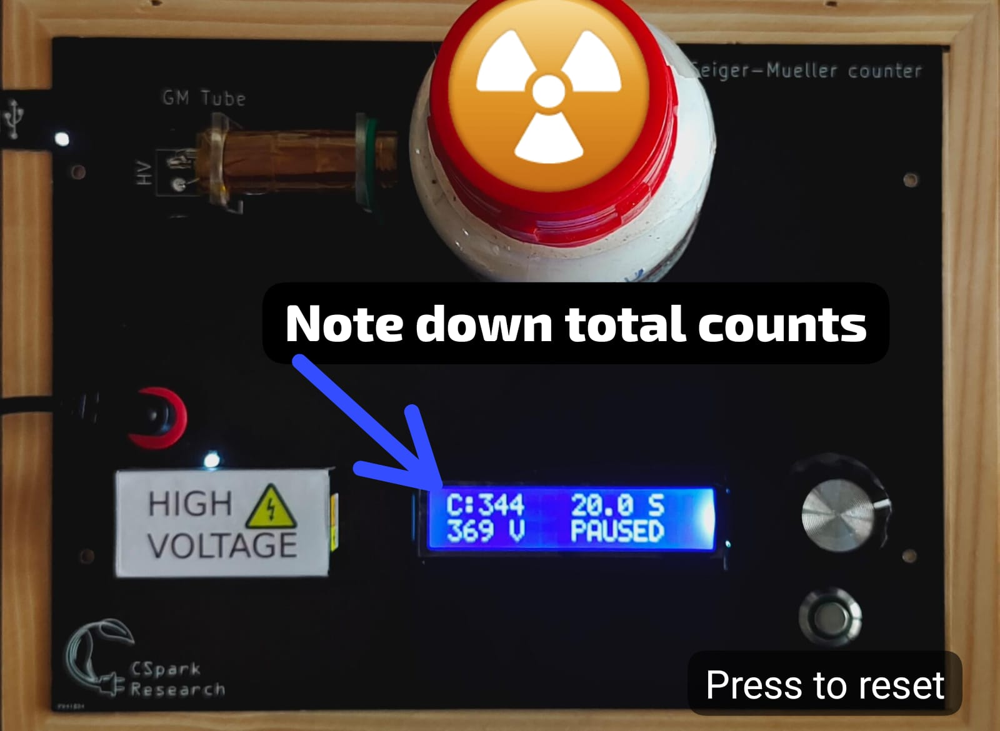

---
social:
  cards_layout_options:
    background_color: blue # Change background color
    background_image: images/cover.jpeg
---

# User Manual 

Welcome to the Manual for our Geiger Counter. This innovative Test and Measurement Device, has been specially designed with students in mind. In today's educational landscape, where hands-on learning and practical skills are crucial, this manual is your gateway to exploring the fascinating world of radiation physics.

???+ "Parts of the hardware"

	The various components of the device are briefly described below.
    
    + Power Supply Input: This Red socket allows you to connect a 12V power supply to it. It is essential to run it.
    + USB Connection socket: This mini USB socket on the left side of the instrument is used to control it from a laptop or phone. The power supply is essential even in USB mode. The LED on the top left corner will glow if the device is properly connected.
    + HV Module : Geiger tubes require high voltages to operate, and this metal shielded device can make up to 1200 Volts. However, it is safe to touch it from the outside since it is well insulated.
    + Geiger Tube : This Geiger tube has a diameter of 15mm, and a mica window. The mica window is thin, so it can detect Alpha, Beta, and Gamma radiation. This also means that it is fragile, so do not touch it with sharp objects such as pencils or tools. To block alpha particles without blocking gamma, it will suffice to place a piece paper or plastic between the source and the mica window. The HV connection to the tube can have high voltages, but the impedance of 6 Mega Ohms ensures that you will feel only a slight burning sensation when touched. Even though it's safe, try not to touch the tube or the connections to it.
    + Rotary knob : Turning this knob allows you to change the voltage from 0 to 1100 Volts . In the `TIMESET` mode, this knob changes the time limit for acquisition
    + Push Button : This allows you to switch between various modes of operation such as `READY`, `TIMESET`, `RUNNING`, and `PAUSED` . For devices with a rotary encoder instead of a potentiometer, you may directly press the encoder knob to switch.
    + Display : This 2 line display shows all information such as the voltage level, counts acquired, elapsed time etc.

  
Let's dive in .

     
## Using the instrument

This section will explain the various controls on the device which are essential for performing experiments with it. The above 4 steps can be repeated for different voltage values in order to get the GM tube characteristics, and identifying the usable voltage range.
    
### Step 1 : Voltage adjustment

The voltage supplied to the GM tube is critical for proper operation. For characterising the tube, we apply different voltages and record count rate for each, in order to identify the usable region of the tube.

rotate the knob to set the voltage. After that , press the button to proceed to the next step. If there is no button, it means the button is part of the knob, and you can press the knob itself.

!!! tip "Adjusting the Voltage"
	

### Step 2 : Acquisition time

To record the count rate , we need the acquisition to stop after a preset time. this can be adjusted when TIMESET is shown on the screen. Rotate the knob to set the time limit. If you set the time limit to 0, the counter will count indefinitely until stopped using the switch.
After placing the source in front of the tube (Refer to the next picture) , press the switch to start recording data

!!! tip "Adjusting the time limit"
	

### Step 3 : Recording data

Recording the data. The counts are shown on the display in real time, and this step will automatically end when the time limit is reached, or if the user presses the switch. The green light around the switch glows when data is being recorded, and will go out when the acquisition ends.

!!! tip "Recording the data"
	

### Step 4 : Acquisition paused

Recording complete. Device is paused.
You can now note down the counts acquired for the given time.

!!! tip "Noting down the reading"
	

